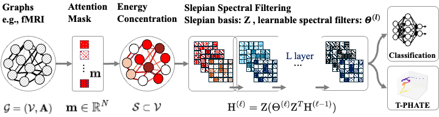

# SlepNet

This repository contains **SlepNet**, a graph neural network designed to process spatiotemporal brain signals by learning localized spectral filters using graph Slepian functions. SlepNet focuses on optimally concentrating signal energy within anatomically meaningful subgraphs while respecting the global graph structure.



---

## Overview

The provided Python training script applies SlepNet to neuroscience graph datasets (e.g., fMRI, EEG). It utilizes:

- **PyTorch** and **PyTorch Geometric** for GNN construction and training  
- **Weights & Biases (wandb)** for experiment logging  
- **scikit-learn** for data splits and classification utilities  
- **tqdm** for real-time progress bars  

Key components:
- Computes graph Laplacian and Slepian basis vectors (with optional neural eigenmapping)  
- Learns node masks and localized filters over selected subgraphs  
- Outputs graph-level or embedding-level predictions  
- Supports Tier 1 (diagnosis) and Tier 2 (downstream) classification tasks  

---

## Requirements

- Python 3.8+
- PyTorch ≥ 1.10
- torch_geometric
- NumPy
- scikit-learn
- tqdm
- wandb

Install all dependencies:

```bash
pip install torch torch_geometric numpy scikit-learn tqdm wandb
```

---

## Arguments

You can customize the behavior of SlepNet using the following command-line arguments:

| Argument           | Type    | Description                                                                 | Default             |
|--------------------|---------|-----------------------------------------------------------------------------|---------------------|
| `--raw_dir`        | `str`   | Path to the dataset directory                                               | `model_paths_ASD`   |
| `--task`           | `str`   | Task type: `"classification"` or `"embedding"`                             | `classification`    |
| `--hidden_dim`     | `int`   | Hidden dimension size for each MLP or spectral layer                        | `250`               |
| `--num_layers`     | `int`   | Number of stacked SlepNet layers                                            | `3`                 |
| `--num_slepians`   | `int`   | Number of Slepian basis vectors used per layer                              | `10`                |
| `--lr`             | `float` | Learning rate for optimizer                                                 | `0.001`             |
| `--wd`             | `float` | Weight decay coefficient                                                    | `0.0005`            |
| `--num_epochs`     | `int`   | Total number of training epochs                                             | `100`               |
| `--batch_size`     | `int`   | Batch size for training and evaluation                                      | `32`                |
| `--gpu`            | `int`   | Index of GPU to use; set to `-1` to run on CPU                              | `0`                 |
| `--use_neuralmap`  | `flag`  | If included, use a learnable neural eigenmap instead of standard `eigh`     | (optional)          |
| `--num_runs`       | `int`   | Number of repeated training runs for statistical robustness                 | `10`                |
| `--layer_type`     | `str`   | Type of SlepNet layer used per block. Options: `batch_energy`, `batch_distance`, | `batch_energy`      |
| `--dataset`        | `str`   | Dataset to train on. |`pvdm`|

## Running the Script

Before running, ensure that `--raw_dir` points to a directory containing compatible PyTorch Geometric `Data` objects. The data loading and preparation are handled internally (e.g., by the `load_graphs_from_directory` utility or a similar function in your pipeline). Consult the data loading code for the expected format.

To run a standard training session on GPU:

```bash
python main.py --raw_dir path_to_data
```

## Weights & Biases Integration

We utilize Weights & Biases for visualization of the losses and accuracies. The script automatically logs training metrics and experiment configurations to [Weights & Biases (wandb)](https://wandb.ai/) if you have an account and have run the following command:

```bash
wandb login


